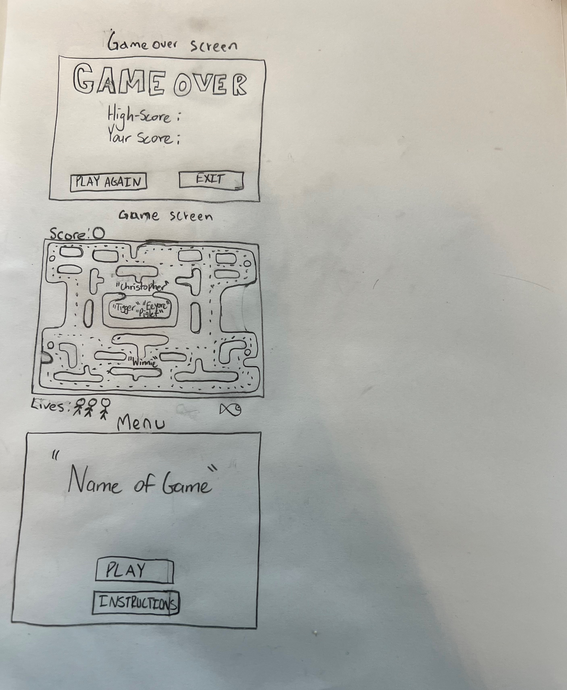
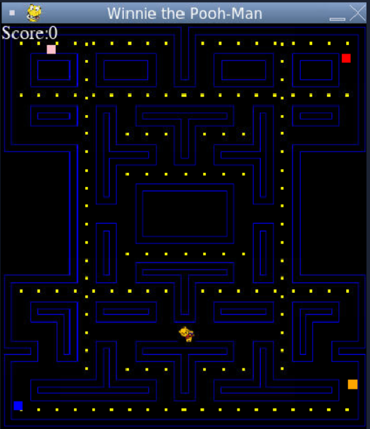
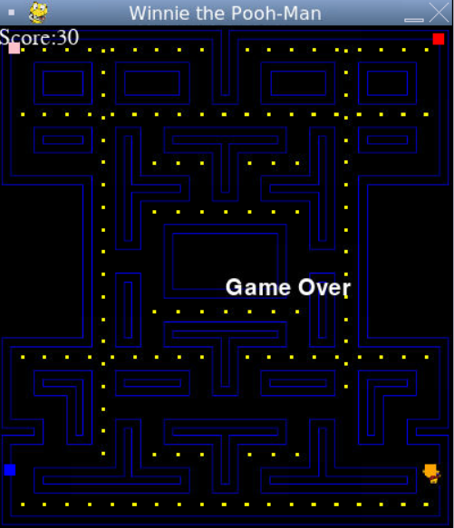
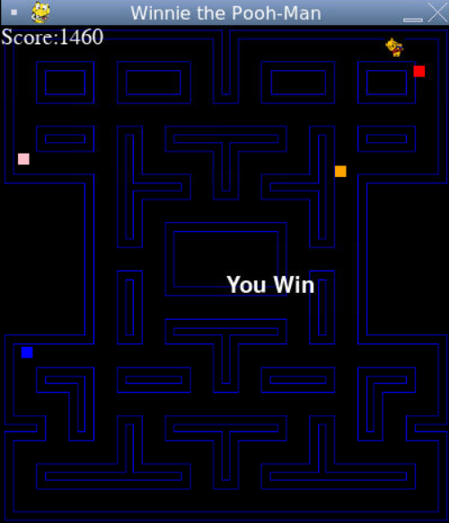
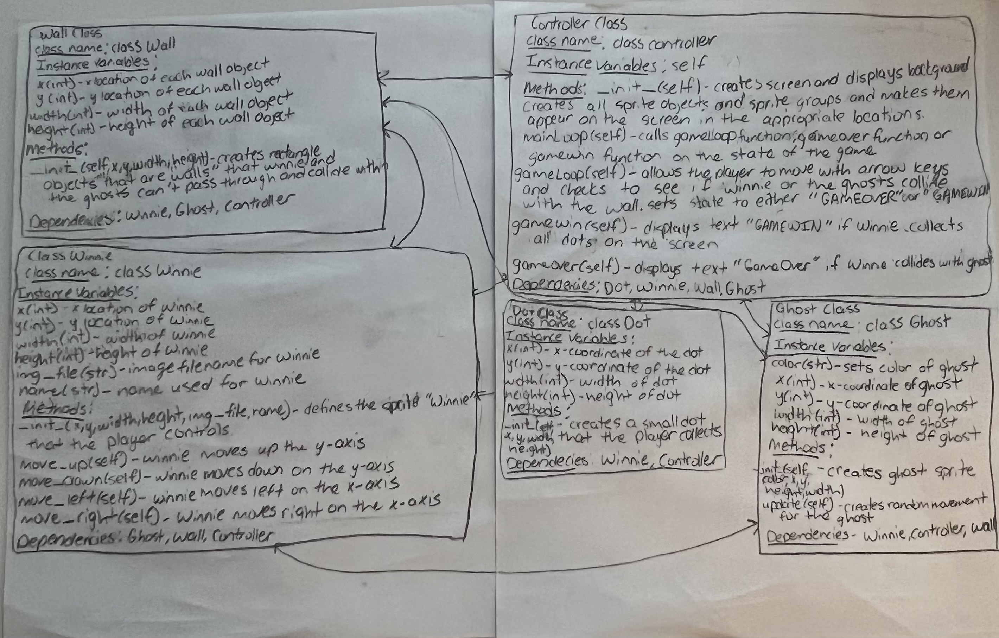

:warning: Everything between << >> needs to be replaced (remove << >> after replacing)
# CS110 Project Proposal
# Blood, Sweat and Tears
## CS 110 Final Project
### Spring, 2022
### [Assignment Description](https://docs.google.com/document/d/1H4R6yLL7som1lglyXWZ04RvTp_RvRFCCBn6sqv-82ps/edit#)

https://replit.com/@JeffreyAbreu/final-project-team-21#main.py

https://docs.google.com/presentation/d/1xdPA0jjXyG17GTlL6O6lLGXNeZ8jRuFPlkdGW8SNqMI/edit#slide=id.g11bf94c026e_2_45

### Team: Team 21
#### Jeffrey Abreu
#### Arena Rahman
#### Aiden Lin

***

## Project Description *(Software Lead)*

In our project, we recreated Pac Man, which is a maze chase game. In this version, we made it Winnie the Pooh themed in which the player instead of being pac-man is Winnie the Pooh and the ghost are his friends from the show. The player controls a sprite, Winnie, that moves through the maze while it collects dots that increase the score and avoids the enemy objects that are known as the ghosts. The ghosts move randomly and the player must avoid colliding with them to not end the game. If the player succeeds in collecting all the dots, they win the game. 

***    

## User Interface Design *(Front-End Specialist)*

### Original GUI Design
  

Menu: The first screen the users see. It displays the words "Name of Game", "Play" and "Instructions". It contains the name of the game, instructions and the to play button. The instruction button tells the user how to play with the arrow keys. (bottom)

Game Screen: In this screen the user will play the game. The maze, the score, the big dots, the small dots, the number lives, the fish collected, the characters in the cage, and winnie the pooh will all appear on the game screen once the game has started. The user will use arrow keys to move up, down, left, or right. (middle)

Game Over: Displays the words "GAME OVER" at the top of the screen. Shows the user's most current score as well as their high score, and allows them to either quit the game or play again. (top)
### Final GUI Design
  
  
  
  
Game Screen: In this screen the user will play the game. The maze, the score, the  dots, the ghosts, and winnie the pooh will all appear on the game screen once the game has started. The user will use arrow keys to move up, down, left, or right. The ghosts will move randomly around the maze. The user's primary objective is to get all the dots on the screen while avoiding being touched by the ghosts. 

Game Over Screen: Displays the text "Game Over" on the screen if the user collides with a ghost.

Game Win Screen: Displays the text 'You Win' if the user manages to collect all the dots and avoid contact with the ghosts.

***        

## Program Design *(Back-End Specialist)*

* Non-Standard libraries
    * pygame: https://www.pygame.org/docs/

* Class Interface Design
    * 
    * 
* Winnie: a class that creates a sprite that will be used as the game character the user controls. It is a nonstationary character that moves throughout the maze collecting dots and avoiding ghosts. It uses the arrow keys to move across the screen.
* Ghost: a class that creates a sprite that will be used as an enemy that has random movement and needs to be avoided or else the game ends and you lose.
* Dot: a class that creates a sprite to represent a dot that the user collects that gives 10 points and leads to victory if all dots are collected. The dots spread around and in most of the maze.
* Maze: a class that creates a wall sprite that will be used in the controller class to create and place in appropriate locations.

## Project Structure *(Software Lead)*

The Project is broken down into the following file structure:

* main.py
* src
    * controller.py
    * dot.py
    * ghost.py
    * maze.py
    * winnie.py
* assets
    * InitialClassesforCSFinalProject.jpg
    * class_diagram.jpg
    * maze3.png
    * winnie.png
    * GameInterfaceforCSFinalProject.jpg
    * gamelose.png
    * gamescreen.png
    * gamewin.png
    * scores.txt
* etc
    * <This is a catch all folder for things that are not part of your project, but you want to keep with your project. Your demo video should go here.>

***

## Tasks and Responsibilities *(Software Lead)*

### Software Lead - Arena Rahman

Worked as integration specialist by ensuring compatibility of the GUI against the controller by running frequent tests to guage the efficiency and qaulity of the code. I outlined the process of the different classes and methods that should be implemented in the ATP. I proposed adding images for Winnie and resizing the image when it was too big to fit in the maze and helped create the walls. I also researched how to add the title for the pygame window and showed my group the documentation for different pygame methods. I showed my group prior examples of pacman and games made in the class to provide us inspriation on what methods we can implement. Whenever we had a question on the code I would either reach out to the professor or TA to help resolve the problems in the group and made sure everyone was on the same page on where we should be in the project timeline.  

### Front End Specialist - Jeffrey Abreu

Front-end lead conducted significant research on the GUI and controller of the program. The GUI in this program consists of one game-screen. The game-screen displays a maze background, as well as the dot, ghost, and player objects. He helped make Winnie fit with the appropriate rectangle object, as well as modify the image so that it looks better on the screen. He also worked with the Back End Specialist on completing the controller. He assisted in placing the wall objects on the screen, as well as implementing the 'collide with wall' feature for Winnie and the ghosts.

### Back End Specialist - Aiden Lin

As the back-end specialist, he created all the classes: dot, maze, ghost and winnie that the controller would later use to run the game. All of us took part in placing the invisible wall sprites onto the appropriate locations so that the ghosts and Winnie will not be able to go through them. He created and placed the dots onto the gamescreen and made the score increase as Winnie collects/collides with the dots. He also did a large part of the controller along with the front-end specialist. 

## Testing *(Software Lead)*

* Our testing strategy is first we run the game and check if the Controller class class is working  by seeing if the game screen which is the maze image boots up. To see if all the sprites loaded, we check if the ghosts, dots and winnie have been loaded onto the screen. The walls are invisible so we check if they are there by moving winnie. We press/hold the up, down, left, or right keys to see if the sprite object that represents the player, Winnie, moves. This tests the single press and holds of the arrow key within the game. After that, we move near any of the walls on the maze to see whether Winnie collides with the walls. We see if this collision will stop Winnie's motion and moves him back so he can move somewhere else that is not a wall. Additionally, we check if Winnie collects/collides with the dots by pressing any of the arrow keys. We see if once Winnie collides with dots that the dots disappear from the screen and increase the score by 10 each time he collects a dot. Also, we test if the collision between the ghost and Winnie works by moving Winnie to one of the ghosts and seeing if once they collide that the text "Game Over" appears. We also check to see if the ghosts are randomly moving if they are not moving in a patterned motion while the game is running. In addition, once all the dots all collected by Winnie, we check to see if the text "You Win" appears, which we programmed to only appear when the sprite group: alldots is empty. 

## ATP

| Step | Procedure | Expected Results| Actual Results |
|:----------------------:|:-------------:|:-----------------:|:--------------: |
|  1  | press the Run button on repl which navigates to folder "python3 main.py" and opens the pygame library to be used in our code| Program starts without any errors |          |
|  2  | run Controller()  | maze background, sprites and score are loaded onto the screen |                 |
|  3  | press/hold left arrow | Winnie moves left when left arrow is pressed/held |
|  4  | press/hold right arrow key | Winnie moves right when the right arrow key is pressed/held. |
|  5  | press/hold up arrow key | Winnie moves up when the up arrow key is pressed/held|
|  6  | press/hold down arrow key| Winnie moves down when up arrow is pressed/held.|
|  7  | Winnie collides with wall| Winnie stops moving when he collides with a wall and can move away from the wall. |
|  8  | Winnie collides with dots. | Winnie collects the dots when he collides with them and the dots disappear from the screen. |
|  9  | Dot collision with Winnie changes the score. | the displayed score increases by 10 each time there is a collision between the dots and Winnie |
|  10 | Winnie collides with Ghost | Winnie can no longer move and the game ends. The ghosts on the screens are no longer moving randomly as well. The text "Game Over" is displayed onto the screen.|
|  11  | Winnie collects all dots in the game | the game ends and Winnie and the ghosts no longer move. The text "You Win" is displayed onto the screen |