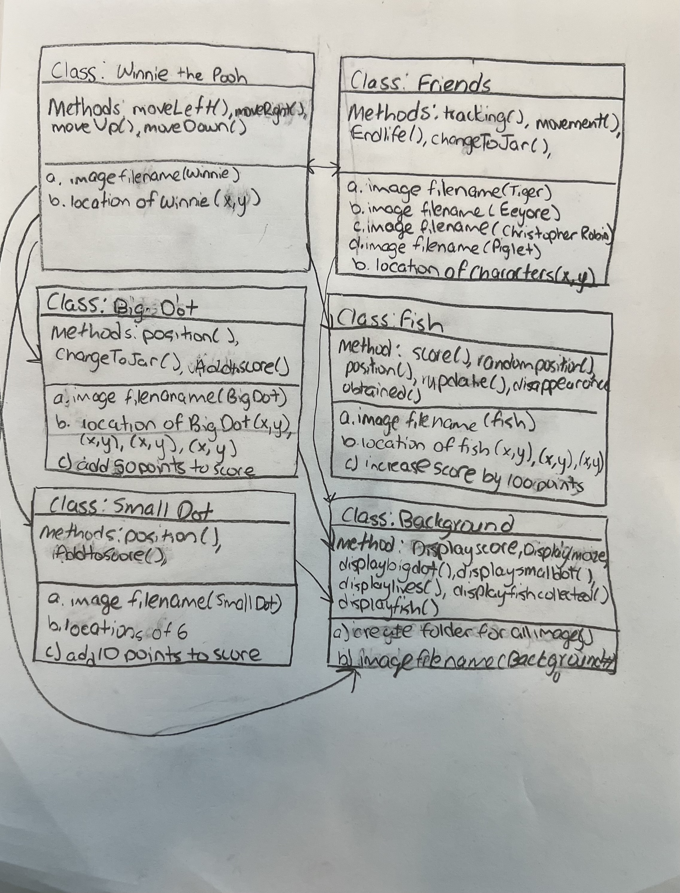

:warning: Everything between << >> needs to be replaced (remove << >> after replacing)
# CS110 Project Proposal
# << Project Title >>
## CS 110 Final Project
### << Semester, Year >>
### [Assignment Description](https://docs.google.com/document/d/1H4R6yLL7som1lglyXWZ04RvTp_RvRFCCBn6sqv-82ps/edit#)

<< [repl](#) >>

<< [link to demo presentation slides](#) >>

### Team: Team 21
#### Jeffrey Abreu
#### Arena Rahman
#### Aiden Lin

***

## Project Description *(Software Lead)*

<< Give an overview of your project >>

***    

## User Interface Design *(Front End Specialist)*

* << A wireframe or drawing of the user interface concept along with a short description of the interface. You should have one for each screen in your program. >>
    * For example, if your program has a start screen, game screen, and game over screen, you should include a wireframe / screenshot / drawing of each one and a short description of the components
      
  Menu: The first screen the users see. It displays the words "Name of Game", "Play" and "Instructions". It contains the name of the game, instructions and the to play button. The instruction button tells the user how to play with the arrow keys. (bottom)
Game Screen: In this screen the user will play the game. The maze, the score, the big dots, the small dots, the number lives, the fish collected, the characters in the cage, and winnie the pooh will all appear on the game screen once the game has started. The user will use arrow keys to move up, down, left, or right. (middle)
Game over Screen: This appears once the player lost all their lives. The statement "Game Over" appears. It displays your current score and high score. There is a play again button and an exit button. (top)

      
* << You should also have a screenshot of each screen for your final GUI >>

***        

## Program Design *(Backend Specialist)*

* Non-Standard libraries
    * << You should have a list of any additional libraries or modules used (pygame, request) beyond non-standard python. >>
    * For each additional module you should include
        * url for the module documentation
        * a short description of the module
* Class Interface Design
    * << A simple drawing that shows the class relationships in your code (see below for an example). >> ![GameInterfaceforCsFinalProject]
         
    * This does not need to be overly detailed, but should show how your code fits into the Model/View/Controller paradigm.
* Classes
    * 
Winnie the Pooh: a class that defines the game character. It a nonstationary character that moves throughout the maze collecting big dots, small dots, and fish. It uses the arrow keys to move across the screen. 
Friends: a class that defines characters that chase after the character the user moves. It can be avoided by going the opposite direction that it moves. 
Big Dot: a class that defines an object the user collects that turns the friends into jars of honey which can be consumed by the user. It also adds 50 points to the score once collected. 
Small Dot: a class that defines an object the user collects that gives the user 10 points per dot. The dots are in most of the maze. 
Fish: a class that defines an object that the user collects and adds 100 points once collected. It spawns in random location throughout the maze after a random set amount of time.  
Background: a class that defines the game screen. It sets up the maze, scoreboard, number of lives, the fish collected, the dots on the maze, and the fish on the maze. 

## Project Structure *(Software Lead)*

The Project is broken down into the following file structure:

* main.py
* src
    * <all of your python files should go here>
* assets
    * <all of your media, i.e. images, font files, etc, should go here)
* etc
    * <This is a catch all folder for things that are not part of your project, but you want to keep with your project. Your demo video should go here.>

***

## Tasks and Responsibilities *(Software Lead)*

   * You must outline the team member roles and who was responsible for each class/method, both individual and collaborative.

### Software Lead - << name >>

<< Worked as integration specialist by... >>

### Front End Specialist - << name >>

<< Front-end lead conducted significant research on... >>

### Back End Specialist - << name >>

<< The back end specialist... >>

## Testing *(Software Lead)*

* << Describe your testing strategy for your project. >>
    * << Example >>

## ATP

| Step | Procedure | Expected Results| Actual Results |
|:----------------------:|:-------------:|:-----------------:|:--------------: |
|  1  | navigate to folder "python3 main.py" and terminal opens| Program starts without any errors |          |
|  2  | run Controller()  | maze background and sprites are loaded onto the screen |                 |
|  3  | press/hold left arrow | Winnie moves left when left arrow is pressed/held |
|  4  | press/hold right arrow key | Winnie moves right when the right arrow key is pressed/held. |
|  5  | press/hold up arrow key | Winnie moves up when the up arrow key is pressed/held|
|  6  | press/hold down arrow key| Winnie moves down when up arrow is pressed/held.|
|  7  | Winnie collides with wall| Winnie stops moving when he collides with a wall. |
|  8  | Winnie collides with dots. |Winnie collects the dots when he collides with them. |

